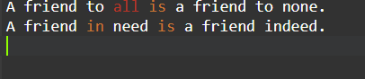
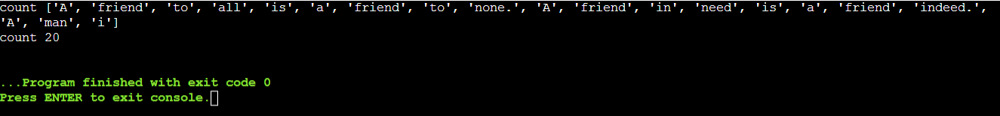

# Word-count
## AIM:
To write a python program for getting the word count from a text.
## EQUIPEMENT'S REQUIRED: 
PC
Anaconda - Python 3.7
## ALGORITHM: 
### Step 1: Open file in read mode.
### Step 2: Read the text using read function.
### Step 3: Split the text using space separator.
### Step 4: The length of the split list should be equal to the number of words innthe text file. 
### Step 5: Now give print()
### Step 6: End the program.
## PROGRAM:
with open("file1.txt","r") as fp:

    A = fp.read()
    count=0
    V=A.split()
    for i in V:
        count+=1 
print("count",V)

print("count",count)

 

### OUTPUT:

## RESULT:
Thus the program is written to find the word count from a text.
